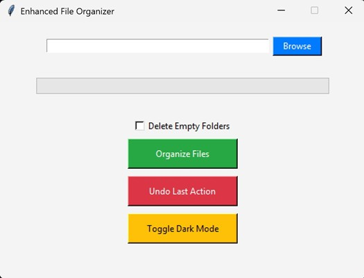
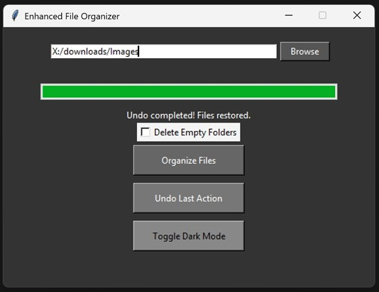

# 📁 Downloads Folder Organizer

Automate your Downloads folder clean-up — categorize files by type, tidy fast with a single click.  
Built with **Python + Tkinter**, distributed as a **standalone Windows `.exe`**.

---

## 🚀 Features

- 🧠 Smart auto-categorization:
  - Images (.jpg, .png), Documents (.pdf, .docx), Videos, Music, Archives, Code, Others
- 🎛️ Undo last operation
- 🎨 Light/Dark modes with a toggle
- 🚫 Optional deletion of empty folders
- 🎥 Live progress bar + status updates
- 🍱 No installation required (just double-click the `.exe`)

---

## 🖥️ Screenshot





---

## ⚙️ Getting Started

1. **Download** the latest release from the [Releases section](https://github.com/BonyKoshy/DownloadsFolderOrganizer/releases).
2. **Extract** the `.zip` file.
3. Double-click `Downloads_Organizer.exe` to launch.
4. Pick your Downloads folder → Choose options → Click **Organize Files**.

---

## 🧩 Options

- ✅ **Undo Last Action** — revert the latest move operation  
- ✅ **Delete Empty Folders** — cleanup leftover empty folders post-organization  
- ✅ **Toggle Dark Mode** — switch between light/dark themes instantly

---

## 🧰 For Hackers & Contributors

Want to tweak the code or recreate in another tech? Here’s how:

```bash
git clone https://github.com/BonyKoshy/DownloadsFolderOrganizer.git
cd DownloadsFolderOrganizer/src
python -m venv .venv
source .venv/bin/activate  # or `.venv\Scripts\activate` on Windows
pip install -r ../requirements.txt
python app.py
